# Chata — ERD & Diagrams

> Derive จาก `chata-database-design.md` (source of truth) — แผนภาพนี้ย่อเพื่อให้อ่านได้
> แสดงเฉพาะ column สำคัญ (PK / FK / column ที่มีความหมายทางธุรกิจ) ไม่ครบทุก column
> ดู column เต็ม + constraint ทั้งหมดที่ design doc หรือ `db/chata.dbml` (paste เข้า dbdiagram.io)

## สารบัญ

1. [Context overview](#1-context-overview)
2. [ERD ราย bounded context (14 กลุ่ม)](#2-erd-ราย-bounded-context)
3. [Cross-context ERD — เงินผูกกับอะไรบ้าง](#3-cross-context-erd)
4. [State machines (7 ตัว)](#4-state-machines)
5. [Sequence diagrams (3 flow หัวใจ)](#5-sequence-diagrams)

---

## 1. Context overview

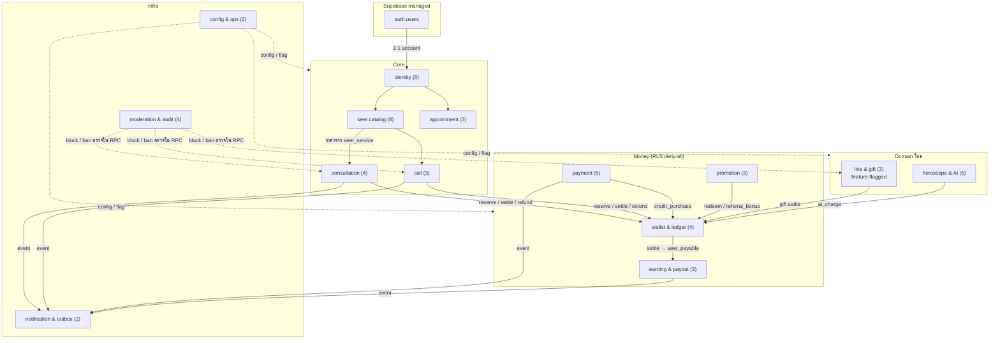
```mermaid
flowchart TB
    subgraph supabase["Supabase managed"]
        AUTH["auth.users"]
    end

    subgraph core["Core"]
        ID["identity (8)"]
        CAT["seer catalog (8)"]
        Q["consultation (4)"]
        APPT["appointment (3)"]
        CALL["call (3)"]
    end

    subgraph money["Money (RLS deny-all)"]
        WAL["wallet & ledger (4)"]
        PAY["payment (5)"]
        PROMO["promotion (3)"]
        EARN["earning & payout (3)"]
    end

    subgraph newdom["Domain ใหม่"]
        HORO["horoscope & AI (5)"]
        LIVE["live & gift (3)<br/>feature-flagged"]
    end

    subgraph infra["Infra"]
        NOTI["notification & outbox (2)"]
        CFG["config & ops (2)"]
        MOD["moderation & audit (4)"]
    end

    AUTH -->|"1:1 account"| ID
    ID --> CAT
    CAT -->|"ราคาจาก seer_service"| Q
    CAT --> CALL
    ID --> APPT
    Q -->|"reserve / settle / refund"| WAL
    CALL -->|"reserve / settle / extend"| WAL
    PAY -->|"credit_purchase"| WAL
    PROMO -->|"redeem / referral_bonus"| WAL
    LIVE -->|"gift settle"| WAL
    HORO -->|"ai_charge"| WAL
    WAL -->|"settle → seer_payable"| EARN
    Q & CALL & PAY & EARN -->|"event"| NOTI
    MOD -.->|"block / ban ตรวจใน RPC"| Q & CALL & LIVE
    CFG -.->|"config / flag"| core & money & newdom
```

**วิธีอ่าน:** กล่อง = bounded context (เลขในวงเล็บ = จำนวนตาราง) เส้นทึบ = FK/data flow หลัก
เส้นประ = การตรวจเชิง policy ตอน runtime ทุกเส้นที่เข้าหา `wallet & ledger` คือจุดที่ต้อง
post double-entry ผ่าน `internal_post_ledger` เท่านั้น

---

## 2. ERD ราย bounded context

### 2.1 identity

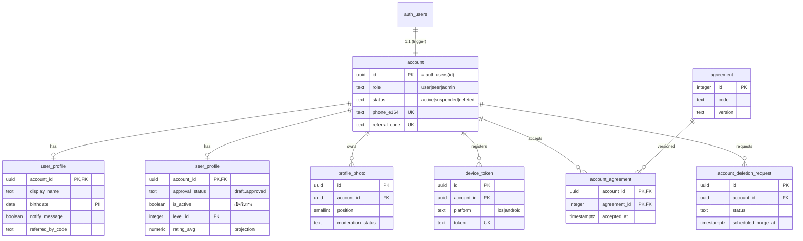
```mermaid
erDiagram
    auth_users ||--|| account : "1:1 (trigger)"
    account ||--o| user_profile : has
    account ||--o| seer_profile : has
    account ||--o{ profile_photo : owns
    account ||--o{ device_token : registers
    account ||--o{ account_agreement : accepts
    agreement ||--o{ account_agreement : versioned
    account ||--o{ account_deletion_request : requests

    account {
        uuid id PK "= auth.users(id)"
        text role "user|seer|admin"
        text status "active|suspended|deleted"
        text phone_e164 UK
        text referral_code UK
    }
    user_profile {
        uuid account_id PK, FK
        text display_name
        date birthdate "PII"
        boolean notify_message
        text referred_by_code
    }
    seer_profile {
        uuid account_id PK, FK
        text approval_status "draft..approved"
        boolean is_active "เปิดรับงาน"
        integer level_id FK
        numeric rating_avg "projection"
    }
    profile_photo {
        uuid id PK
        uuid account_id FK
        smallint position
        text moderation_status
    }
    device_token {
        uuid id PK
        uuid account_id FK
        text platform "ios|android"
        text token UK
    }
    account_deletion_request {
        uuid id PK
        uuid account_id FK
        text status
        timestamptz scheduled_purge_at
    }
    agreement {
        integer id PK
        text code
        text version
    }
    account_agreement {
        uuid account_id PK, FK
        integer agreement_id PK, FK
        timestamptz accepted_at
    }
```

**วิธีอ่าน:** `account` คือแกน identity เดียวของทั้งระบบ (uuid = `auth.uid()`)
user กับ seer เป็นคนละบัญชี — profile แยกตาราง 1:1 ตาม role

### 2.2 seer catalog

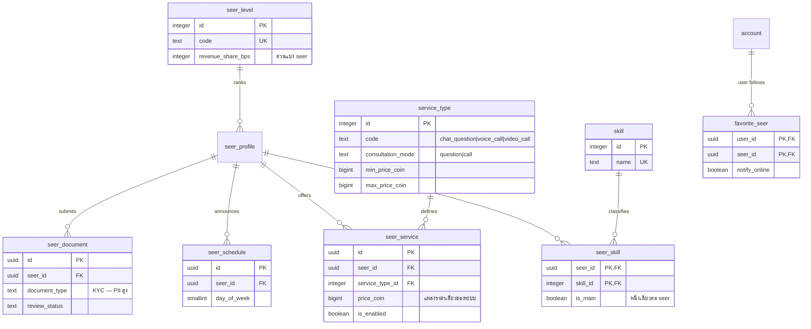
```mermaid
erDiagram
    seer_profile ||--o{ seer_skill : has
    skill ||--o{ seer_skill : classifies
    seer_profile ||--o{ seer_service : offers
    service_type ||--o{ seer_service : defines
    seer_profile ||--o{ seer_schedule : announces
    seer_profile ||--o{ seer_document : submits
    seer_level ||--o{ seer_profile : ranks
    account ||--o{ favorite_seer : "user follows"

    seer_level {
        integer id PK
        text code UK
        integer revenue_share_bps "ส่วนแบ่ง seer"
    }
    skill {
        integer id PK
        text name UK
    }
    seer_skill {
        uuid seer_id PK, FK
        integer skill_id PK, FK
        boolean is_main "หนึ่งเดียวต่อ seer"
    }
    service_type {
        integer id PK
        text code "chat_question|voice_call|video_call"
        text consultation_mode "question|call"
        bigint min_price_coin
        bigint max_price_coin
    }
    seer_service {
        uuid id PK
        uuid seer_id FK
        integer service_type_id FK
        bigint price_coin "แหล่งราคาเดียวของระบบ"
        boolean is_enabled
    }
    seer_schedule {
        uuid id PK
        uuid seer_id FK
        smallint day_of_week
    }
    seer_document {
        uuid id PK
        uuid seer_id FK
        text document_type "KYC — PII สูง"
        text review_status
    }
    favorite_seer {
        uuid user_id PK, FK
        uuid seer_id PK, FK
        boolean notify_online
    }
```

**วิธีอ่าน:** `seer_service.price_coin` คือราคาเดียวที่ RPC ฝั่งซื้อยอมอ่าน —
client ส่งราคามาเองไม่มีผล; `service_type.consultation_mode` ชี้ว่างานลง `question` หรือ `call_transaction`

### 2.3 consultation

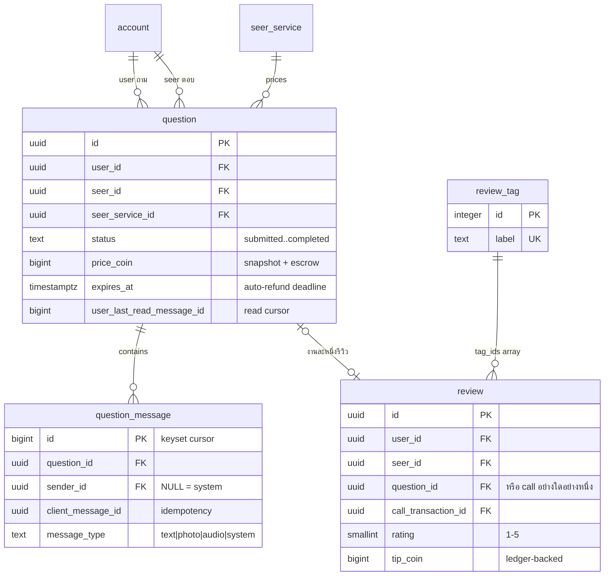
```mermaid
erDiagram
    account ||--o{ question : "user ถาม"
    account ||--o{ question : "seer ตอบ"
    seer_service ||--o{ question : prices
    question ||--o{ question_message : contains
    question |o--o| review : "งานละหนึ่งรีวิว"
    review_tag ||--o{ review : "tag_ids array"

    question {
        uuid id PK
        uuid user_id FK
        uuid seer_id FK
        uuid seer_service_id FK
        text status "submitted..completed"
        bigint price_coin "snapshot + escrow"
        timestamptz expires_at "auto-refund deadline"
        bigint user_last_read_message_id "read cursor"
    }
    question_message {
        bigint id PK "keyset cursor"
        uuid question_id FK
        uuid sender_id FK "NULL = system"
        uuid client_message_id "idempotency"
        text message_type "text|photo|audio|system"
    }
    review {
        uuid id PK
        uuid user_id FK
        uuid seer_id FK
        uuid question_id FK "หรือ call อย่างใดอย่างหนึ่ง"
        uuid call_transaction_id FK
        smallint rating "1-5"
        bigint tip_coin "ledger-backed"
    }
    review_tag {
        integer id PK
        text label UK
    }
```

**วิธีอ่าน:** `question` escrow coin ตั้งแต่ submit จนถึง terminal state
`review` ผูกงานที่จบแล้วหนึ่งชิ้น (question **หรือ** call) — tip ที่แนบมาโพสต์ ledger ใน RPC เดียวกัน

### 2.4 appointment

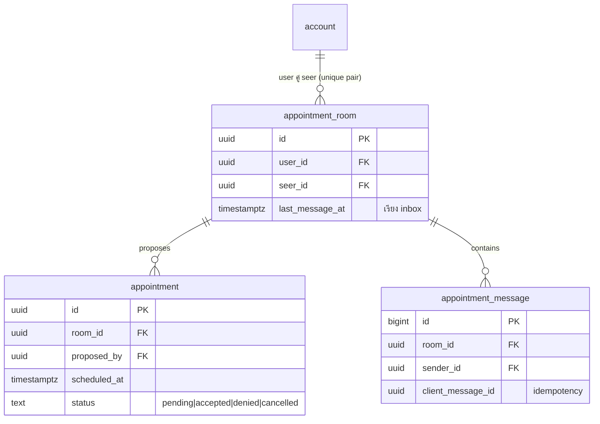
```mermaid
erDiagram
    account ||--o{ appointment_room : "user คู่ seer (unique pair)"
    appointment_room ||--o{ appointment : proposes
    appointment_room ||--o{ appointment_message : contains

    appointment_room {
        uuid id PK
        uuid user_id FK
        uuid seer_id FK
        timestamptz last_message_at "เรียง inbox"
    }
    appointment {
        uuid id PK
        uuid room_id FK
        uuid proposed_by FK
        timestamptz scheduled_at
        text status "pending|accepted|denied|cancelled"
    }
    appointment_message {
        bigint id PK
        uuid room_id FK
        uuid sender_id FK
        uuid client_message_id "idempotency"
    }
```

**วิธีอ่าน:** ห้องนัดหมายเป็นห้องถาวรต่อคู่ (สร้างครั้งเดียว) ไม่แตะเงิน —
ข้อเสนอนัดค้างได้ทีละหนึ่งต่อห้อง (partial unique WHERE pending)

### 2.5 call

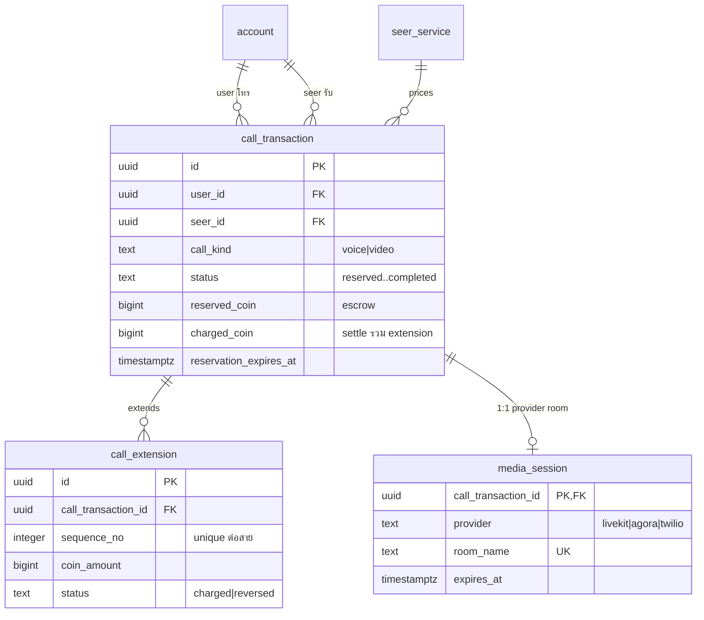
```mermaid
erDiagram
    account ||--o{ call_transaction : "user โทร"
    account ||--o{ call_transaction : "seer รับ"
    seer_service ||--o{ call_transaction : prices
    call_transaction ||--o{ call_extension : extends
    call_transaction ||--o| media_session : "1:1 provider room"

    call_transaction {
        uuid id PK
        uuid user_id FK
        uuid seer_id FK
        text call_kind "voice|video"
        text status "reserved..completed"
        bigint reserved_coin "escrow"
        bigint charged_coin "settle รวม extension"
        timestamptz reservation_expires_at
    }
    call_extension {
        uuid id PK
        uuid call_transaction_id FK
        integer sequence_no "unique ต่อสาย"
        bigint coin_amount
        text status "charged|reversed"
    }
    media_session {
        uuid call_transaction_id PK, FK
        text provider "livekit|agora|twilio"
        text room_name UK
        timestamptz expires_at
    }
```

**วิธีอ่าน:** `call_transaction` คือ authority ของ call state — Realtime broadcast เป็นแค่
การแจ้งข่าว; extension insert หลัง charge สำเร็จเสมอ (แถวมี = เงินตัดแล้ว)

### 2.6 wallet & ledger (deny-all ทั้งกลุ่ม)

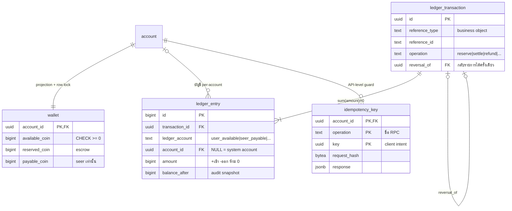
```mermaid
erDiagram
    account ||--|| wallet : "projection + row lock"
    ledger_transaction ||--|{ ledger_entry : "sum(amount)=0"
    account |o--o{ ledger_entry : "บัญชี per-account"
    ledger_transaction |o--o| ledger_transaction : "reversal_of"
    account ||--o{ idempotency_key : "API-level guard"

    wallet {
        uuid account_id PK, FK
        bigint available_coin "CHECK >= 0"
        bigint reserved_coin "escrow"
        bigint payable_coin "seer เท่านั้น"
    }
    ledger_transaction {
        uuid id PK
        text reference_type "business object"
        text reference_id
        text operation "reserve|settle|refund|..."
        uuid reversal_of FK "กลับรายการได้ครั้งเดียว"
    }
    ledger_entry {
        bigint id PK
        uuid transaction_id FK
        text ledger_account "user_available|seer_payable|..."
        uuid account_id FK "NULL = system account"
        bigint amount "+เข้า -ออก ห้าม 0"
        bigint balance_after "audit snapshot"
    }
    idempotency_key {
        uuid account_id PK, FK
        text operation PK "ชื่อ RPC"
        uuid key PK "client intent"
        bytea request_hash
        jsonb response
    }
```

**วิธีอ่าน:** unique `(reference_type, reference_id, operation)` บนหัว transaction คือ
idempotency ระดับบัญชี — เหตุการณ์ธุรกิจเดียว post ซ้ำไม่ได้; `wallet` คือ projection
ที่อัปเดตใน txn เดียวกับ entry และเป็นแถวที่ทุก financial RPC ต้อง `FOR UPDATE` ก่อน

### 2.7 payment

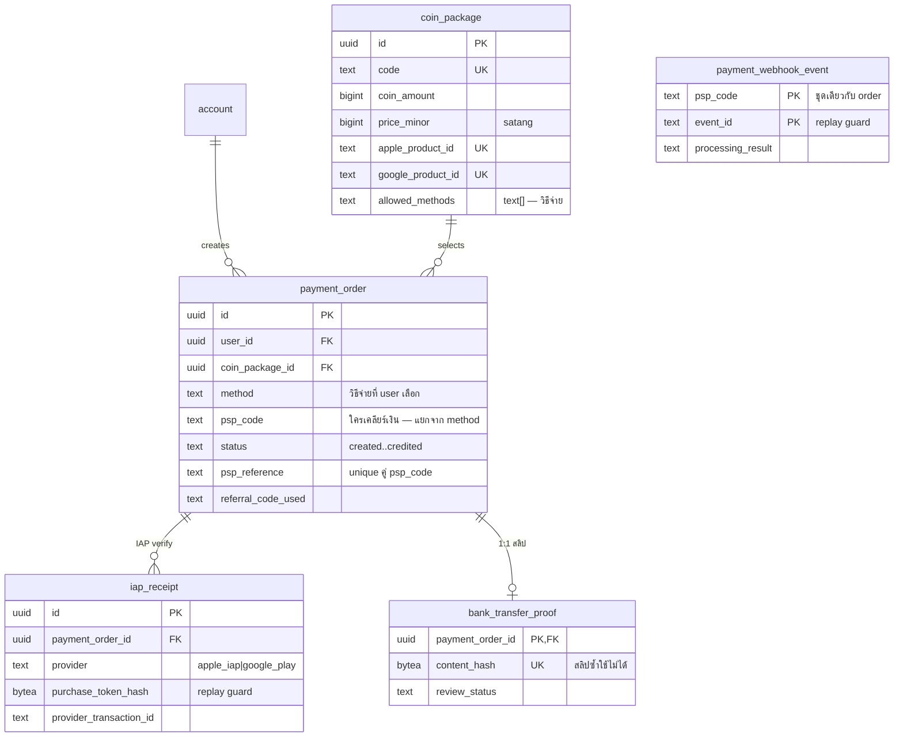
```mermaid
erDiagram
    account ||--o{ payment_order : creates
    coin_package ||--o{ payment_order : selects
    payment_order ||--o{ iap_receipt : "IAP verify"
    payment_order ||--o| bank_transfer_proof : "1:1 สลิป"

    coin_package {
        uuid id PK
        text code UK
        bigint coin_amount
        bigint price_minor "satang"
        text apple_product_id UK
        text google_product_id UK
        text allowed_methods "text[] — วิธีจ่าย"
    }
    payment_order {
        uuid id PK
        uuid user_id FK
        uuid coin_package_id FK
        text method "วิธีจ่ายที่ user เลือก"
        text psp_code "ใครเคลียร์เงิน — แยกจาก method"
        text status "created..credited"
        text psp_reference "unique คู่ psp_code"
        text referral_code_used
    }
    iap_receipt {
        uuid id PK
        uuid payment_order_id FK
        text provider "apple_iap|google_play"
        bytea purchase_token_hash "replay guard"
        text provider_transaction_id
    }
    bank_transfer_proof {
        uuid payment_order_id PK, FK
        bytea content_hash UK "สลิปซ้ำใช้ไม่ได้"
        text review_status
    }
    payment_webhook_event {
        text psp_code PK "ชุดเดียวกับ order"
        text event_id PK "replay guard"
        text processing_result
    }
```

**วิธีอ่าน:** `method` (วิธีจ่าย) แยกจาก `psp_code` (ผู้เคลียร์เงิน) — method เดียว
สลับ PSP ได้ผ่าน `app_config` matrix โดยไม่แตะ schema; `payment_webhook_event` ยืนเดี่ยว
(ไม่มี FK เข้า order — map ด้วย `(psp_code, psp_reference)` ตอนประมวลผล) เพื่อรับ event
ที่มาก่อน order state จะพร้อม

### 2.8 promotion

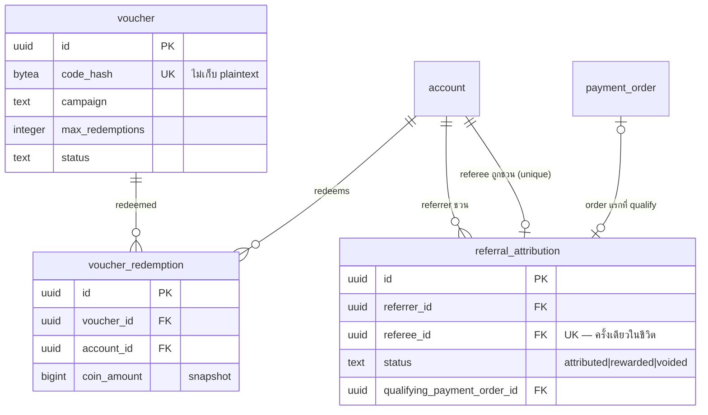
```mermaid
erDiagram
    voucher ||--o{ voucher_redemption : redeemed
    account ||--o{ voucher_redemption : redeems
    account ||--o{ referral_attribution : "referrer ชวน"
    account ||--o| referral_attribution : "referee ถูกชวน (unique)"
    payment_order |o--o| referral_attribution : "order แรกที่ qualify"

    voucher {
        uuid id PK
        bytea code_hash UK "ไม่เก็บ plaintext"
        text campaign
        integer max_redemptions
        text status
    }
    voucher_redemption {
        uuid id PK
        uuid voucher_id FK
        uuid account_id FK
        bigint coin_amount "snapshot"
    }
    referral_attribution {
        uuid id PK
        uuid referrer_id FK
        uuid referee_id FK "UK — ครั้งเดียวในชีวิต"
        text status "attributed|rewarded|voided"
        uuid qualifying_payment_order_id FK
    }
```

**วิธีอ่าน:** referral จ่ายโบนัสตอน referee **เติมเงินจริงครั้งแรก** (จุดจากใน
`internal_credit_payment`) ไม่ใช่ตอนสมัคร — กัน fraud สมัครทิ้ง

### 2.9 seer earning & payout

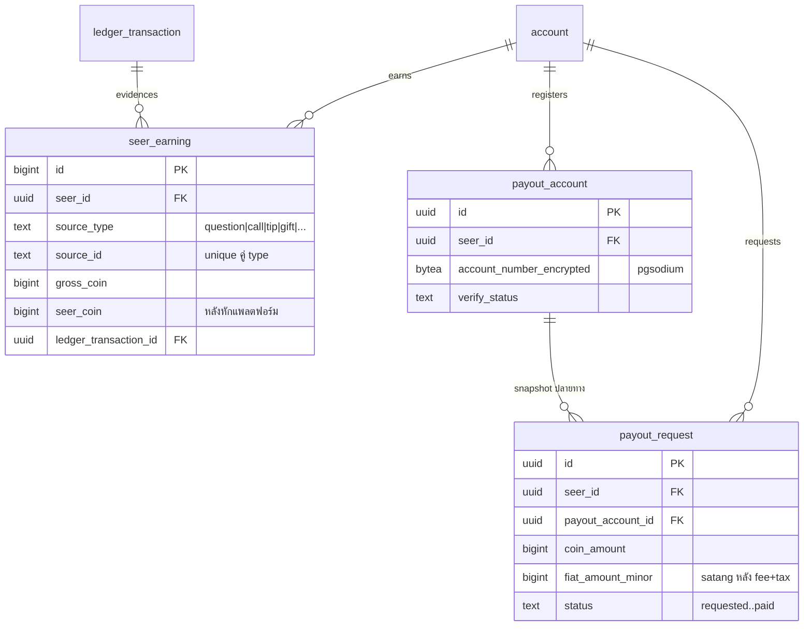
```mermaid
erDiagram
    account ||--o{ seer_earning : earns
    ledger_transaction ||--o{ seer_earning : evidences
    account ||--o{ payout_account : registers
    account ||--o{ payout_request : requests
    payout_account ||--o{ payout_request : "snapshot ปลายทาง"

    seer_earning {
        bigint id PK
        uuid seer_id FK
        text source_type "question|call|tip|gift|..."
        text source_id "unique คู่ type"
        bigint gross_coin
        bigint seer_coin "หลังหักแพลตฟอร์ม"
        uuid ledger_transaction_id FK
    }
    payout_account {
        uuid id PK
        uuid seer_id FK
        bytea account_number_encrypted "pgsodium"
        text verify_status
    }
    payout_request {
        uuid id PK
        uuid seer_id FK
        uuid payout_account_id FK
        bigint coin_amount
        bigint fiat_amount_minor "satang หลัง fee+tax"
        text status "requested..paid"
    }
```

**วิธีอ่าน:** `seer_earning` เป็น reporting projection (เขียนพร้อม settle) —
หลักฐานบัญชีจริงคือ ledger; payout หัก `payable_coin` ตั้งแต่ `requested` เพื่อกันถอนซ้อน

### 2.10 horoscope & AI

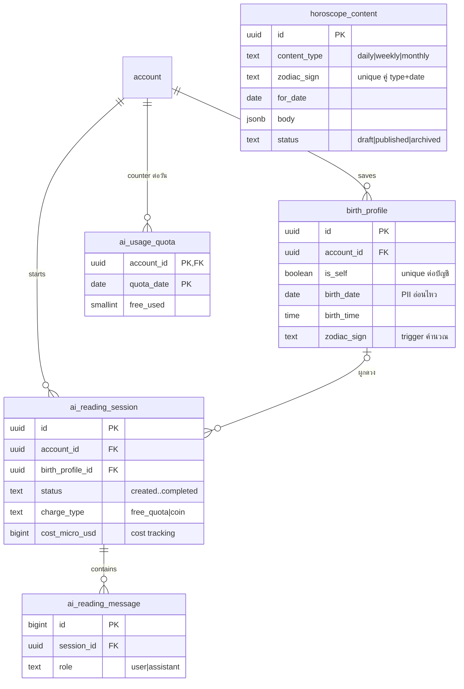
```mermaid
erDiagram
    account ||--o{ birth_profile : saves
    account ||--o{ ai_reading_session : starts
    birth_profile |o--o{ ai_reading_session : "ผูกดวง"
    ai_reading_session ||--o{ ai_reading_message : contains
    account ||--o{ ai_usage_quota : "counter ต่อวัน"

    birth_profile {
        uuid id PK
        uuid account_id FK
        boolean is_self "unique ต่อบัญชี"
        date birth_date "PII อ่อนไหว"
        time birth_time
        text zodiac_sign "trigger คำนวณ"
    }
    horoscope_content {
        uuid id PK
        text content_type "daily|weekly|monthly"
        text zodiac_sign "unique คู่ type+date"
        date for_date
        jsonb body
        text status "draft|published|archived"
    }
    ai_reading_session {
        uuid id PK
        uuid account_id FK
        uuid birth_profile_id FK
        text status "created..completed"
        text charge_type "free_quota|coin"
        bigint cost_micro_usd "cost tracking"
    }
    ai_reading_message {
        bigint id PK
        uuid session_id FK
        text role "user|assistant"
    }
    ai_usage_quota {
        uuid account_id PK, FK
        date quota_date PK
        smallint free_used
    }
```

**วิธีอ่าน:** `horoscope_content` ยืนเดี่ยว (ทุกคนราศีเดียวกันอ่านชิ้นเดียวกัน —
ต้นทุน AI คงที่/วัน) ส่วน `ai_reading_session` เป็นของส่วนตัว มี quota ฟรี/วัน แล้วจ่าย coin

### 2.11 live stream & gift (feature-flagged)

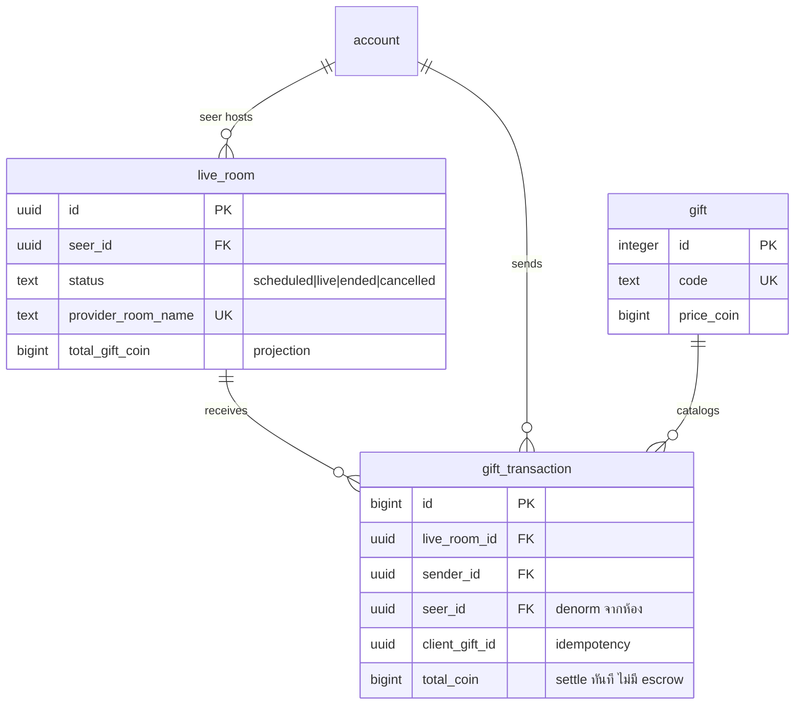
```mermaid
erDiagram
    account ||--o{ live_room : "seer hosts"
    live_room ||--o{ gift_transaction : receives
    account ||--o{ gift_transaction : sends
    gift ||--o{ gift_transaction : catalogs

    live_room {
        uuid id PK
        uuid seer_id FK
        text status "scheduled|live|ended|cancelled"
        text provider_room_name UK
        bigint total_gift_coin "projection"
    }
    gift {
        integer id PK
        text code UK
        bigint price_coin
    }
    gift_transaction {
        bigint id PK
        uuid live_room_id FK
        uuid sender_id FK
        uuid seer_id FK "denorm จากห้อง"
        uuid client_gift_id "idempotency"
        bigint total_coin "settle ทันที ไม่มี escrow"
    }
```

**วิธีอ่าน:** DB เก็บเฉพาะสิ่งที่เป็นเงิน/audit — วิดีโออยู่ media provider,
แชทไลฟ์เป็น broadcast ephemeral ไม่ persist; context นี้ไม่มี FK จากกลุ่มอื่นชี้เข้า
จึงปิดทั้ง domain ด้วย flag ได้

### 2.12 notification & outbox

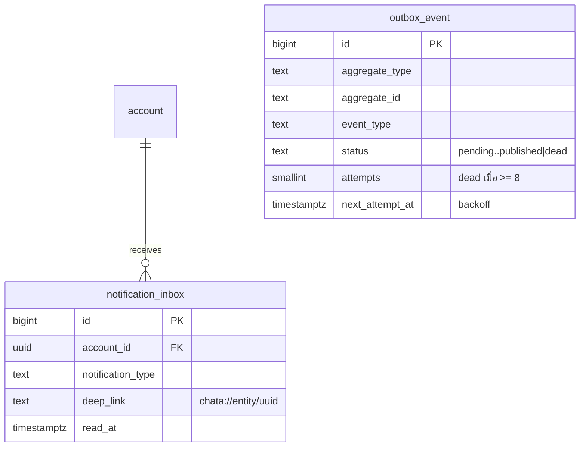
```mermaid
erDiagram
    account ||--o{ notification_inbox : receives

    notification_inbox {
        bigint id PK
        uuid account_id FK
        text notification_type
        text deep_link "chata://entity/uuid"
        timestamptz read_at
    }
    outbox_event {
        bigint id PK
        text aggregate_type
        text aggregate_id
        text event_type
        text status "pending..published|dead"
        smallint attempts "dead เมื่อ >= 8"
        timestamptz next_attempt_at "backoff"
    }
```

**วิธีอ่าน:** `outbox_event` ไม่มี FK — ตั้งใจให้เป็น log กลางที่ insert ใน txn เดียวกับ
domain change แล้ว dispatcher claim ด้วย `SKIP LOCKED`; `notification_inbox` คือผลปลายทาง
ที่ push-sender เขียนให้ user เห็นในกระดิ่ง

### 2.13 config & ops

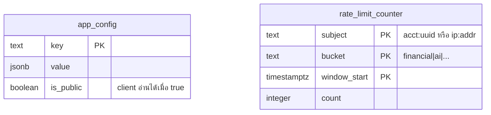
```mermaid
erDiagram
    app_config {
        text key PK
        jsonb value
        boolean is_public "client อ่านได้เมื่อ true"
    }
    rate_limit_counter {
        text subject PK "acct:uuid หรือ ip:addr"
        text bucket PK "financial|ai|..."
        timestamptz window_start PK
        integer count
    }
```

**วิธีอ่าน:** สองตารางนี้ standalone — `app_config` แทน bootstrap catalog + feature flag
(รวม `payment.method_psp_matrix`), `rate_limit_counter` คือ fixed-window rate limit
บนตารางแทน Redis

### 2.14 moderation & audit

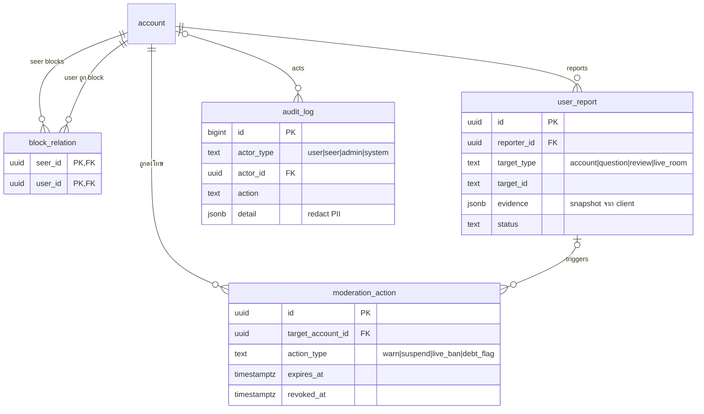
```mermaid
erDiagram
    account ||--o{ block_relation : "seer blocks"
    account ||--o{ block_relation : "user ถูก block"
    account ||--o{ user_report : reports
    account ||--o{ moderation_action : "ถูกลงโทษ"
    user_report |o--o{ moderation_action : triggers
    account |o--o{ audit_log : acts

    block_relation {
        uuid seer_id PK, FK
        uuid user_id PK, FK
    }
    user_report {
        uuid id PK
        uuid reporter_id FK
        text target_type "account|question|review|live_room"
        text target_id
        jsonb evidence "snapshot จาก client"
        text status
    }
    moderation_action {
        uuid id PK
        uuid target_account_id FK
        text action_type "warn|suspend|live_ban|debt_flag"
        timestamptz expires_at
        timestamptz revoked_at
    }
    audit_log {
        bigint id PK
        text actor_type "user|seer|admin|system"
        uuid actor_id FK
        text action
        jsonb detail "redact PII"
    }
```

**วิธีอ่าน:** `user_report` = ขาเข้า (ผู้ใช้ร้องเรียน), `moderation_action` = ขาออก
(แพลตฟอร์มลงโทษ); `audit_log` เก็บเหตุการณ์ที่ไม่ใช่เงิน (เงินมี ledger เป็น audit ในตัว)

---

## 3. Cross-context ERD

เส้นที่ข้าม bounded context — เห็นชัดว่า**เงินทุกทางบรรจบที่ ledger** และอะไรอ้างอะไรข้ามกลุ่ม

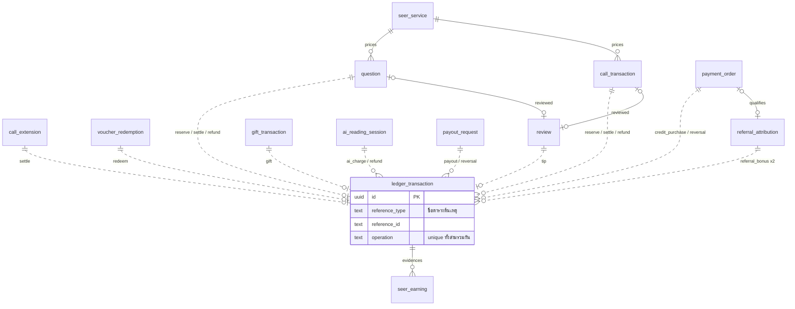
```mermaid
erDiagram
    %% money hub: ทุก business event ที่แตะเงิน post หัว transaction พร้อม unique reference
    question ||..o| ledger_transaction : "reserve / settle / refund"
    call_transaction ||..o{ ledger_transaction : "reserve / settle / refund"
    call_extension ||..o| ledger_transaction : "settle"
    payment_order ||..o{ ledger_transaction : "credit_purchase / reversal"
    voucher_redemption ||..o| ledger_transaction : "redeem"
    referral_attribution ||..o{ ledger_transaction : "referral_bonus x2"
    gift_transaction ||..o| ledger_transaction : "gift"
    ai_reading_session ||..o{ ledger_transaction : "ai_charge / refund"
    payout_request ||..o{ ledger_transaction : "payout / reversal"
    review ||..o| ledger_transaction : "tip"

    %% hard FK ข้าม context
    ledger_transaction ||--o{ seer_earning : evidences
    seer_service ||--o{ question : prices
    seer_service ||--o{ call_transaction : prices
    payment_order |o--o| referral_attribution : qualifies
    question |o--o| review : reviewed
    call_transaction |o--o| review : reviewed

    ledger_transaction {
        uuid id PK
        text reference_type "ชื่อตารางต้นเหตุ"
        text reference_id
        text operation "unique ทั้งสามรวมกัน"
    }
```

**วิธีอ่าน:** เส้นประ (`..`) = การอ้างแบบ polymorphic ผ่าน `(reference_type, reference_id,
operation)` — ไม่ใช่ hard FK (ตั้งใจ เพื่อให้ ledger ไม่ต้องมี nullable FK 10 ช่อง)
แต่ unique constraint บนสามค่านี้ทำหน้าที่ idempotency; เส้นทึบ = FK จริงข้าม context
ซึ่งมีน้อยมากโดยตั้งใจ (ลด coupling ระหว่างกลุ่ม)

---

## 4. State machines

### 4.1 question

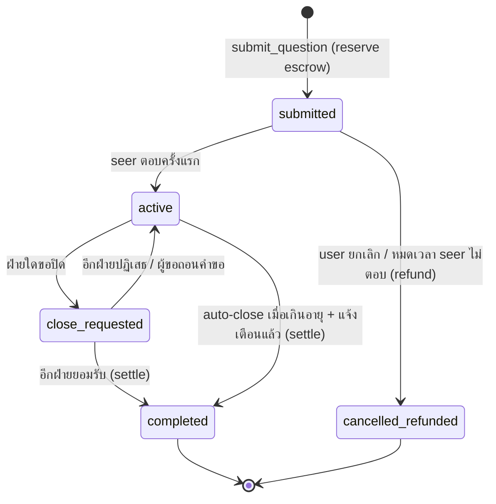
```mermaid
stateDiagram-v2
    [*] --> submitted : submit_question (reserve escrow)
    submitted --> active : seer ตอบครั้งแรก
    submitted --> cancelled_refunded : user ยกเลิก / หมดเวลา seer ไม่ตอบ (refund)
    active --> close_requested : ฝ่ายใดขอปิด
    close_requested --> active : อีกฝ่ายปฏิเสธ / ผู้ขอถอนคำขอ
    close_requested --> completed : อีกฝ่ายยอมรับ (settle)
    active --> completed : auto-close เมื่อเกินอายุ + แจ้งเตือนแล้ว (settle)
    completed --> [*]
    cancelled_refunded --> [*]
```

ทุก transition เป็น compare-and-set ใน RPC + lock แถว; `[*]` ปลายทาง = terminal
(settle/refund เกิดพร้อม transition ใน transaction เดียว)

### 4.2 appointment

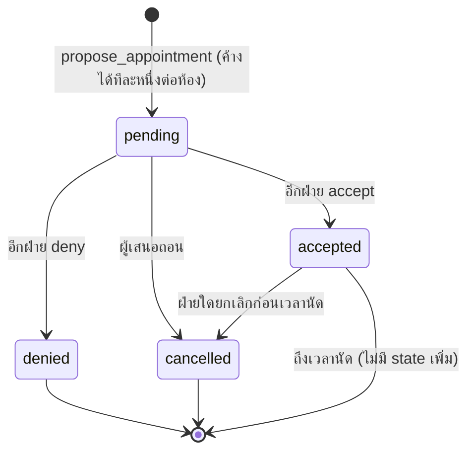
```mermaid
stateDiagram-v2
    [*] --> pending : propose_appointment (ค้างได้ทีละหนึ่งต่อห้อง)
    pending --> accepted : อีกฝ่าย accept
    pending --> denied : อีกฝ่าย deny
    pending --> cancelled : ผู้เสนอถอน
    accepted --> cancelled : ฝ่ายใดยกเลิกก่อนเวลานัด
    denied --> [*]
    cancelled --> [*]
    accepted --> [*] : ถึงเวลานัด (ไม่มี state เพิ่ม)
```

ผู้ตอบต้องไม่ใช่ผู้เสนอ (ตรวจใน RPC) — ไม่มีเงินเกี่ยวข้องใน state machine นี้

### 4.3 call_transaction

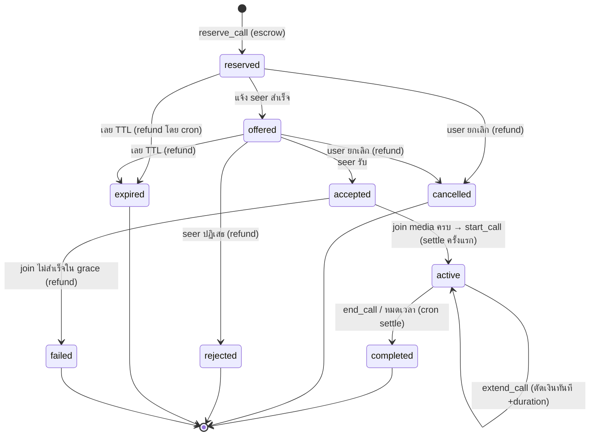
```mermaid
stateDiagram-v2
    [*] --> reserved : reserve_call (escrow)
    reserved --> offered : แจ้ง seer สำเร็จ
    reserved --> cancelled : user ยกเลิก (refund)
    reserved --> expired : เลย TTL (refund โดย cron)
    offered --> cancelled : user ยกเลิก (refund)
    offered --> expired : เลย TTL (refund)
    offered --> rejected : seer ปฏิเสธ (refund)
    offered --> accepted : seer รับ
    accepted --> active : join media ครบ → start_call (settle ครั้งแรก)
    accepted --> failed : join ไม่สำเร็จใน grace (refund)
    active --> active : extend_call (ตัดเงินทันที +duration)
    active --> completed : end_call / หมดเวลา (cron settle)
    completed --> [*]
    cancelled --> [*]
    rejected --> [*]
    expired --> [*]
    failed --> [*]
```

reconnect ไม่ใช่ state ใน DB (เป็นเรื่อง Presence/client) — DB สนใจเฉพาะ milestone
ที่มีผลบัญชี; timeout ทุกตัวตัดสินโดย cron ฝั่ง server ไม่ใช่ timer ของ client

### 4.4 payment_order

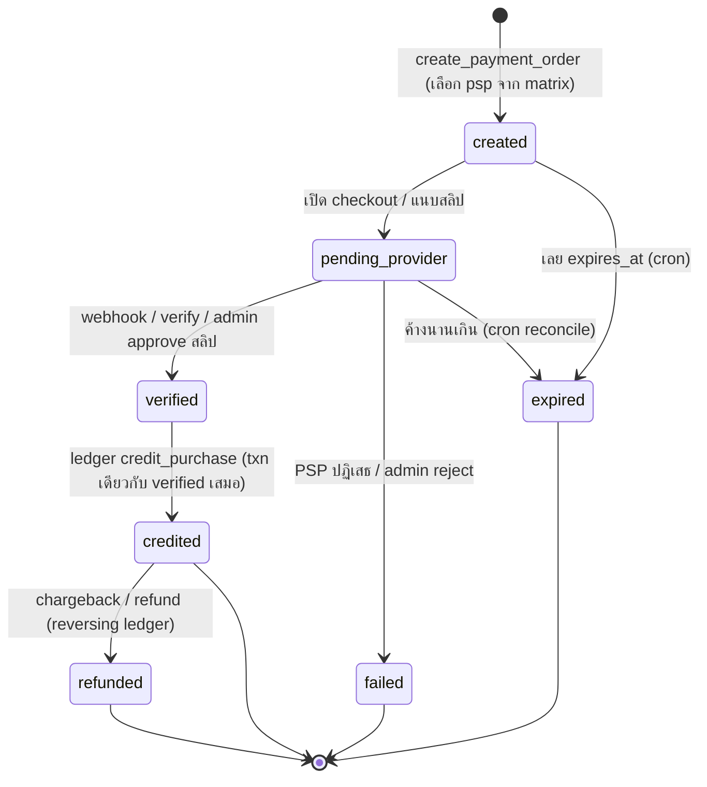
```mermaid
stateDiagram-v2
    [*] --> created : create_payment_order (เลือก psp จาก matrix)
    created --> pending_provider : เปิด checkout / แนบสลิป
    created --> expired : เลย expires_at (cron)
    pending_provider --> verified : webhook / verify / admin approve สลิป
    pending_provider --> failed : PSP ปฏิเสธ / admin reject
    pending_provider --> expired : ค้างนานเกิน (cron reconcile)
    verified --> credited : ledger credit_purchase (txn เดียวกับ verified เสมอ)
    credited --> refunded : chargeback / refund (reversing ledger)
    credited --> [*]
    failed --> [*]
    expired --> [*]
    refunded --> [*]
```

`verified → credited` ไม่มีทางแยกจากกันข้าม transaction — ถ้า ledger post ไม่สำเร็จ
order ไม่ถูก mark credited

### 4.5 payout_request

```mermaid
stateDiagram-v2
    [*] --> requested : request_payout (ledger หัก payable ทันที)
    requested --> approved : admin ตรวจ
    requested --> rejected : admin ปฏิเสธ (reversing คืน payable)
    requested --> cancelled : seer ถอนคำขอ (reversing คืน)
    approved --> paid : โอนจริงสำเร็จ
    approved --> rejected : ยกเลิกก่อนโอน (reversing คืน)
    paid --> [*]
    rejected --> [*]
    cancelled --> [*]
```

การหักเงินเกิดตอน `requested` เพื่อกันถอนซ้อน — ทุกทางออกที่ไม่ใช่ `paid`
ต้องมี reversing entry คู่กันเสมอ

### 4.6 seer approval (seer_profile.approval_status)

```mermaid
stateDiagram-v2
    [*] --> draft : สมัคร seer
    draft --> submitted : ยื่นเอกสารครบ
    submitted --> approved : admin อนุมัติ
    submitted --> rejected : admin ปฏิเสธ (แจ้งเหตุผล)
    rejected --> submitted : แก้แล้วยื่นใหม่
    approved --> submitted : แก้ข้อมูลสำคัญ → รอตรวจซ้ำ
    approved --> [*]
```

`approval_status` เป็นแกนแยกจาก `is_active` (เปิดรับงาน) และ presence (ต่อเน็ตอยู่) —
สามแกนอิสระ ห้ามยุบรวม

### 4.7 live_room

```mermaid
stateDiagram-v2
    [*] --> scheduled : create_live_room
    scheduled --> live : start_live (mint provider room)
    scheduled --> cancelled : seer ยกเลิก
    live --> ended : end_live / เกิน max duration (cron)
    ended --> [*]
    cancelled --> [*]
```

`send_gift` รับเฉพาะห้อง `live`; ห้องค้างสถานะ live ถูก cron ปิดเสมอ

---

## 5. Sequence diagrams

### 5.1 ซื้อคำถาม → ตอบ → ปิด → settle

```mermaid
sequenceDiagram
    autonumber
    actor U as User (iOS)
    participant RPC as RPC (SECURITY DEFINER)
    participant DB as Postgres (wallet/ledger/question)
    participant OB as outbox → push
    actor S as Seer

    U->>RPC: submit_question(service_id, msg, p_key)
    RPC->>DB: lock wallet(U) FOR UPDATE
    RPC->>DB: อ่านราคาจาก seer_service (ไม่เชื่อ client)
    RPC->>DB: ledger: user_available→user_reserved (reserve)
    RPC->>DB: insert question(submitted) + message แรก + outbox
    DB-->>U: commit → question id
    OB-->>S: push "มีคำถามใหม่"
    S->>DB: insert question_message (direct RLS, participant)
    Note over DB: trigger: status submitted→active ผ่าน RPC ภายใน + outbox push หา U
    U->>RPC: request_close_question(q_id, p_key)
    RPC->>DB: CAS active→close_requested + system message
    S->>RPC: respond_close_question(q_id, accept=true, p_key)
    RPC->>DB: lock wallet(U), wallet(S) ตามลำดับ account_id
    RPC->>DB: ledger: user_reserved→seer_payable+platform_revenue (settle)
    RPC->>DB: CAS →completed + insert seer_earning + outbox
    DB-->>S: commit → รายได้เข้า payable
```

**วิธีอ่าน:** ราคามาจากตารางเสมอ (ขั้น 3); เงินขยับพร้อม state ใน transaction เดียว
ทั้งขา reserve (4-5) และขา settle (13-15); push ทุกดอกออกทาง outbox หลัง commit

### 5.2 เติมเงินผ่าน PSP → webhook → credit

```mermaid
sequenceDiagram
    autonumber
    actor U as User (iOS)
    participant RPC as RPC create_payment_order
    participant PSP as PSP (ตาม psp_code)
    participant EF as Edge payment-webhook
    participant DB as Postgres

    U->>RPC: create_payment_order(package, method=promptpay, p_key)
    RPC->>DB: validate method ∈ allowed_methods + เลือก psp_code จาก matrix
    RPC->>DB: insert payment_order(created, snapshot ราคา/coin)
    DB-->>U: order id + ข้อมูลเปิด checkout
    U->>PSP: จ่ายผ่าน checkout ของ PSP
    PSP->>EF: webhook /payment-webhook/{psp_code} (signed)
    EF->>EF: verify signature ตามสเปก PSP
    EF->>DB: insert payment_webhook_event (PK psp_code+event_id)
    alt PK ชน (event ซ้ำ)
        DB-->>EF: conflict → ตอบ 200 ทิ้ง (replay guard)
    else event ใหม่
        EF->>DB: internal_credit_payment(order_id, psp_reference)
        DB->>DB: lock order + CAS →verified→credited
        DB->>DB: lock wallet(U) + ledger credit_purchase (+bonus)
        DB->>DB: ถ้า order แรกของ referee → ledger referral_bonus x2
        DB->>DB: insert outbox payment.credited
        DB-->>EF: commit
        EF-->>PSP: 200
    end
    Note over U,DB: client ไม่เคยเป็นผู้ยืนยันเงิน — redirect กลับ app เป็นแค่ UI signal<br/>แล้ว app อ่าน balance ใหม่จาก v_my_wallet
```

**วิธีอ่าน:** เงินเข้าได้ทางเดียวคือ webhook/verify ที่ผ่าน replay guard สองชั้น
(webhook PK + ledger unique reference); Apple/Google ใช้ flow เดียวกันแต่แทน PSP
ด้วย verify Edge Function ของ store

### 5.3 Call: reserve → confirm → active → extend → end → settle

```mermaid
sequenceDiagram
    autonumber
    actor U as User
    participant RPC as RPC
    participant DB as Postgres (call/wallet/ledger)
    participant RT as Realtime (broadcast)
    participant MT as Edge media-token
    actor S as Seer

    U->>RPC: reserve_call(service_id, p_key)
    RPC->>DB: lock wallet(U) + ledger reserve + insert call(reserved, TTL)
    DB->>RT: broadcast inbox:{seer} call.requested
    RT-->>S: เสียงเรียกเข้า (+ push ถ้า app ปิด)
    S->>RPC: respond_call(call_id, accept=true, p_key)
    RPC->>DB: CAS offered→accepted
    par ทั้งสองฝั่งขอ token
        U->>MT: ขอ media token (ตรวจ participant + non-terminal)
        S->>MT: ขอ media token
    end
    MT->>RPC: start_call(call_id) เมื่อเงื่อนไข join ครบ
    RPC->>DB: CAS accepted→active + ledger settle ครั้งแรก + seer_earning
    DB->>RT: broadcast call:{id} call.started
    U->>RPC: extend_call(call_id, seq=1, p_key)
    RPC->>DB: lock wallet(U) + ledger settle extension + insert call_extension(unique seq)
    DB->>RT: broadcast call.extended (+duration)
    U->>RPC: end_call(call_id, user_end, p_key)
    RPC->>DB: CAS active→completed (ครั้งแรก win ครั้งถัดมาคืนผลเดิม)
    DB->>RT: broadcast call.ended + outbox media cleanup
    Note over DB: cron กวาด: reserved/offered เลย TTL → refund,<br/>active เกินเวลา → settle (timeout)
```

**วิธีอ่าน:** Realtime เป็น signaling เท่านั้น — ทุกจุดที่เงินขยับ (2, 11, 13) คือ RPC
ที่ lock wallet และ post ledger; ถ้า broadcast หาย client resync จาก `call_transaction`
ตอน reconnect; timeout เป็นหน้าที่ cron ไม่ใช่ client

---

*จบเอกสาร — คู่กันกับ `db/chata.dbml` (ERD interactive บน dbdiagram.io)*
